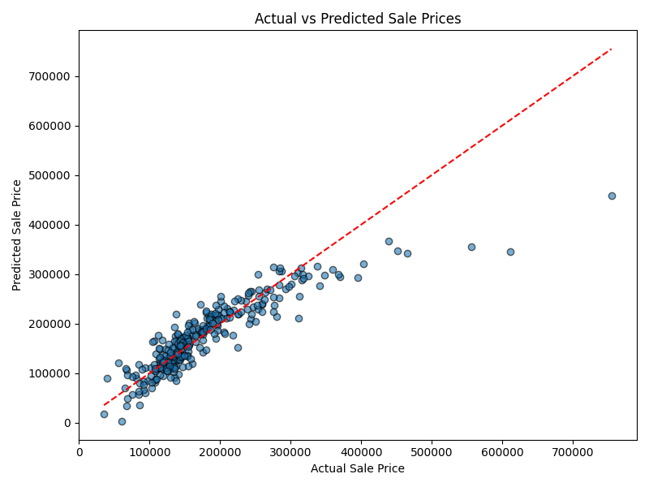
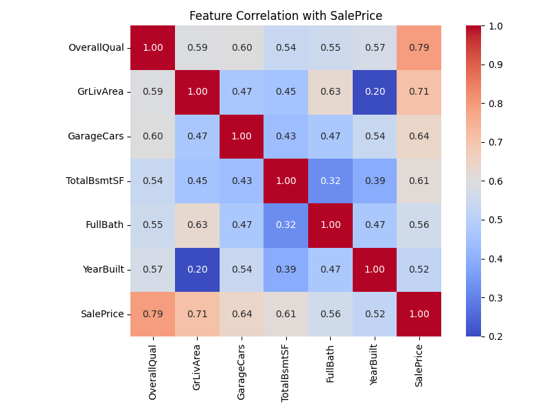
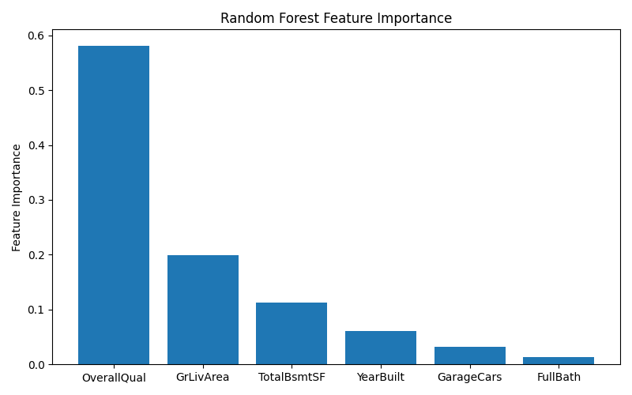

# 🏠 House Price Predictor

A machine learning project that predicts house prices using data from the classic Kaggle dataset: *House Prices - Advanced Regression Techniques*.

This project demonstrates end-to-end regression modeling, model comparison, evaluation, and visualization using Python and scikit-learn.

---

## 📊 Models Used

- **Linear Regression**  
- **Random Forest Regressor**

Both models were trained and evaluated using MAE and R² metrics. Random Forest significantly outperformed the baseline linear model.

---

## 🧠 Features Used

- `OverallQual`
- `GrLivArea`
- `GarageCars`
- `TotalBsmtSF`
- `FullBath`
- `YearBuilt`

Feature selection was informed by correlation heatmaps and Random Forest feature importance plots.

---

## 📈 Evaluation Metrics

| Model              | MAE      | R² Score |
|-------------------|----------|----------|
| Linear Regression | ~$25,320 | 0.79     |
| Random Forest     | ~$19,211 | 0.89     |

---

## 📸 Visualizations

All visuals are saved in the `/visuals/` directory and showcased below:

### 🎯 Actual vs Predicted Prices
Shows how well the model’s predictions align with actual sale prices.



---

### 🔥 Correlation Heatmap
Used to select the most relevant features based on their correlation with sale price.



---

### 🌲 Feature Importance (Random Forest)
Highlights the most influential features in the Random Forest model.



---

## 🛠️ Technologies Used

- Python
- Jupyter Notebook
- pandas, NumPy, scikit-learn, matplotlib, seaborn

---

## 💡 What I Learned

- How to build and compare regression models
- How to interpret model output and performance
- How to visualize predictions and feature importance
- How to structure and document a clean ML notebook for portfolio use

---

## 📁 Project Structure

```
house-price-predictor/
├── data/              # Raw CSVs (not committed)
├── models/            # (Optional) Saved models
├── notebooks/         # Jupyter notebook (main.ipynb)
├── visuals/           # Saved charts for README/docs
├── requirements.txt   # Python libraries used
├── .gitignore
└── README.md
```

---

## 🚀 Future Improvements

- Full preprocessing pipeline (missing values, encoding)
- Hyperparameter tuning (GridSearchCV)
- Cross-validation for better generalization
- Deployment as a Streamlit web app in a separate repo
